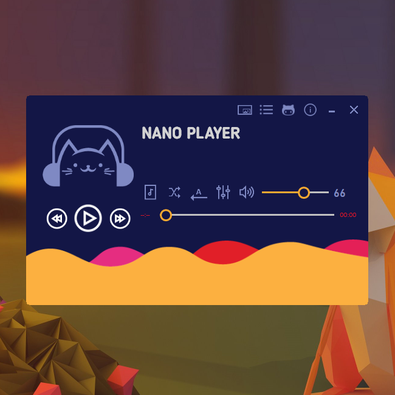
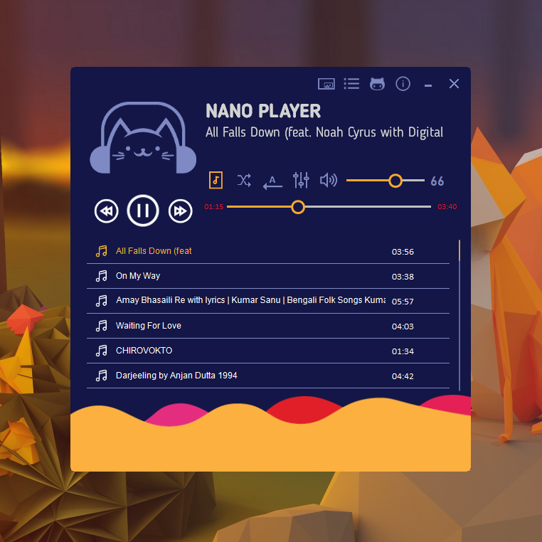
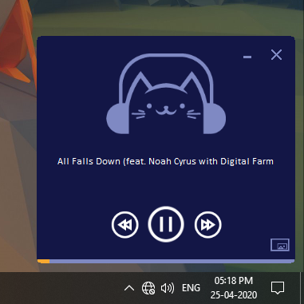
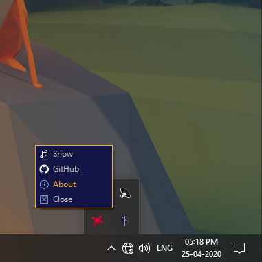

# NANO
A simple music player for windows using Visual Basic .NET.

## Installation
Download and install two UI frameworks [Guna Framework](https://gunaframework.com/) and [Bunifu Framework](https://bunifuframework.com/).

I use Windows Media Player dll for this project which is available in windows system just add in tool box.

This project also contains the installer and uninstaller build and copy the setup.exe and uninstall.exe in main project's build directory. Then you can able to install the music player and uninstall from the control panel. 
